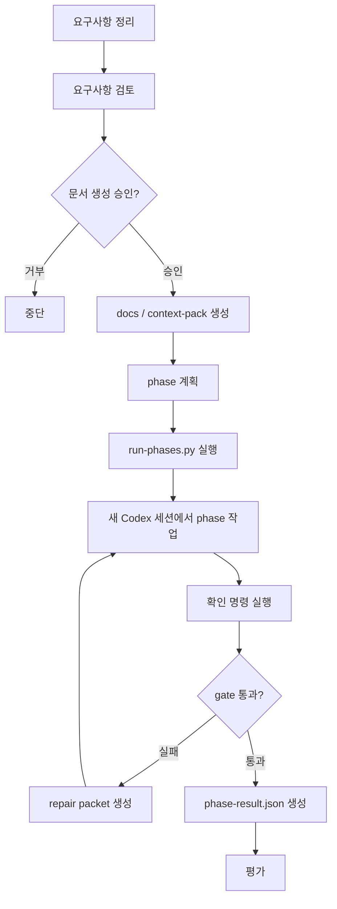

# codex-harness

Codex와 긴 작업을 하다 보면 대화가 금방 지저분해집니다.

처음에 정한 기준, 중간에 버린 선택지, 나중에 바뀐 결정이 한 대화 안에 같이 남습니다. 작업이 길어질수록 Codex가 무엇을 기준으로 고쳐야 하는지 흐려집니다.

codex-harness는 이 문제를 줄이기 위한 작업 방식입니다.

대화를 계속 이어 붙이지 않습니다. 요구사항, 결정, 제약, 이전 phase의 기록을 파일로 남깁니다. 그리고 phase마다 필요한 파일만 골라 새 Codex 세션에 넘깁니다.

코드는 여전히 Codex가 고칩니다. 대신 작업 기준은 파일과 실행 스크립트가 잡습니다. `scripts/harness/run-phases.py`는 필요한 컨텍스트로 프롬프트를 만들고, Codex를 실행하고, 확인 명령과 결과 파일로 통과 여부를 남깁니다.



Codex의 말이 아니라, 파일로 남은 기준과 실행 기록을 보고 다음 단계로 넘어갑니다.

## 실행 기록

여기서 말하는 실행 기록은 "이 phase를 실제로 실행했고, 확인까지 했다"는 파일 기록입니다.

예를 들면 다음과 같습니다.

```text
phase 프롬프트      → Codex에게 실제로 넘긴 작업 지시
contract           → 이번 phase가 지켜야 하는 범위와 확인 명령
checklist          → contract를 사람이 읽기 쉽게 풀어쓴 목록
command result     → 확인 명령을 실행한 결과
changed files      → 이번 phase에서 바뀐 파일 목록
handoff            → Codex가 다음 phase에 남긴 요약
gate               → 실행 스크립트의 통과/실패 판정
repair packet      → 실패했을 때 다음 시도에 넘길 실패 요약
result             → phase 실행 결과를 모은 최종 기록
```

즉, "Codex가 말했다"가 아니라 "파일로 남아 있다"가 완료 기준입니다.

## 그래서 뭐가 달라지나

일반적인 Codex 사용:

```text
요청 → 바로 구현 → Codex가 완료라고 말함
```

codex-harness 사용:

```text
요청
→ 요구사항 정리
→ 만들 가치 검토
→ 문서와 컨텍스트 저장
→ phase 계획
→ 실행 스크립트가 컨텍스트 조합
→ Codex가 새 세션에서 phase 구현
→ 실행 스크립트가 명령 결과와 실행 기록으로 완료 판단
→ 실패하면 실패 이유를 정리해 같은 phase를 다시 실행
→ 새 컨텍스트에서 평가
```

이렇게 달라집니다.

- 다음 세션은 긴 대화 대신 정리된 파일만 읽습니다.
- phase마다 읽을 문서, 고칠 파일, 확인 명령이 정해집니다.
- Codex가 "완료했다"고 말해도 실행 기록이 없으면 완료가 아닙니다.

대화를 통째로 넘기면 결정과 노이즈가 같이 넘어갑니다. 틀린 가정, 버린 선택지, 중간에 바뀐 기준까지 다음 작업에 섞입니다.

codex-harness는 그중 확정된 것만 파일로 남깁니다. 그래서 다음 phase가 같은 기준을 다시 읽을 수 있고, 나중에 무엇을 근거로 작업했는지도 확인할 수 있습니다.

## 왜 체이닝이 아닌가

체이닝은 보통 이런 식입니다.

```text
AGENT.md
  → Plan Agent
    → Verify Agent
      → Execute Agent
```

codex-harness는 이 흐름을 기본으로 잡지 않습니다.

물론 체이닝이 무조건 나쁜 건 아닙니다. 짧고 단순한 작업이면 이 정도로도 충분합니다.

길어지면 이야기가 달라집니다.

- 앞 agent가 잘못 이해한 내용을 다음 agent가 그대로 이어받습니다.
- 검토 agent가 "좋다"고 말해도 실제 확인 명령이 빠질 수 있습니다.
- 실행 agent는 앞 대화의 분위기까지 같이 물려받습니다.
- 어느 지점에서 기준이 바뀌었는지 나중에 추적하기 어렵습니다.

그래서 codex-harness는 agent끼리 대화를 넘기지 않습니다. 넘기는 건 정리된 파일입니다.

```text
대화에서 확정된 결정만 뽑는다
→ docs, context-pack, phase 파일로 남긴다
→ 실행 스크립트가 현재 phase에 필요한 파일만 조합한다
→ 새 Codex 세션에 넘긴다
→ 실행 스크립트가 완료 여부를 판단한다
```

핵심은 대화를 이어 붙이는 것이 아니라, 필요한 파일만 다시 조합하는 것입니다.

phase 프롬프트는 보통 이렇게 만들어집니다.

```text
현재 phase 프롬프트
= 공통 하네스 규칙
+ task 문서
+ 고정 컨텍스트
+ 이전 phase 요약
+ 현재 phase 지시서
```

`context-pack`은 한 번 쓰고 버리는 프롬프트가 아닙니다. task 폴더에 남는 컨텍스트 저장소입니다. phase마다 필요한 파일만 꺼내 씁니다.

## 역할은 셋으로 나뉩니다

중복 없이 보면 역할은 이렇습니다.

```text
대상              책임
---------------   --------------------------------------------
사용자            요구사항 설명, 문서 생성 승인
Codex             phase 안에서 코드 수정, handoff 작성
run-phases.py     Codex 실행, 확인 명령, 재시도, 완료 판정
hooks             tool 사용 전후의 명백한 범위 위반 차단
verify-task.py    task, phase, 실행 기록 검증
```

1. 사용자

   요구사항을 설명하고, 문서 생성 여부를 승인합니다.

2. Codex

   phase 안에서 코드를 고치고, 다음 phase가 읽을 handoff를 남깁니다.

3. 실행 스크립트와 hooks

   실행 스크립트는 Codex 실행, 재시도, 실패, 완료 판정을 맡습니다. hooks는 Codex가 tool을 쓰기 전후에 끼어드는 자동 검사입니다. 명백한 계약 위반을 막거나 되돌려 보냅니다.

이 분리를 지키는 이유는 단순합니다.

작업자는 Codex여도, 완료 판정까지 Codex에게 맡기면 자기 작업을 스스로 채점하게 됩니다.

## 전체 흐름

codex-harness는 다음 순서로 진행합니다.

1. 요구사항 정리
2. 요구사항 검토
3. 문서 생성 승인
4. 컨텍스트 수집
5. phase 계획
6. phase 실행
7. 평가

각 단계의 책임은 겹치지 않습니다.

## 사용 예시

Codex에서 이렇게 시작합니다.

```text
$codex-harness

list-tasks.py를 만들어줘.

요구사항:
- tasks/index.json을 읽는다.
- task id, 이름, 상태를 출력한다.
- --status 옵션으로 상태를 필터링할 수 있다.

완료 조건:
- python3 scripts/harness/list-tasks.py --status pending 이 동작한다.
- 테스트 또는 실행 예시가 남아 있어야 한다.
```

바로 코드를 고치지 않습니다.

먼저 Codex가 질문합니다.

```text
tasks/index.json의 스키마는 이미 고정되어 있나요?
출력 형식은 사람이 읽는 표 형태면 충분한가요, JSON도 필요하나요?
이 명령은 프로젝트 내부 도구인가요, 사용자에게 노출되는 CLI인가요?
```

요구사항이 정리되면 만들 가치와 범위를 확인합니다. 통과하면 문서를 만들어도 되는지 묻습니다.

```text
문서와 task 파일을 생성해도 될까요?
```

승인하면 task 폴더가 생깁니다.

```text
tasks/0-list-tasks/
  docs/
  phases/
  context-pack/
    static/
    runtime/
    handoffs/
```

그 다음 phase가 실행됩니다.

```text
phase0: 문서와 실행 계약 정리
phase1: list-tasks.py 구현
phase2: 확인 명령과 테스트 보강
```

각 phase는 새 Codex 세션에서 실행됩니다. 다음 phase는 긴 대화 전체가 아니라 `docs`, `context-pack`, 이전 phase의 `handoff`만 읽습니다.

완료 여부는 실행 기록으로 확인합니다.

```text
context-pack/runtime/phase1-gate.json
context-pack/runtime/phase1-repair-packet.md
context-pack/runtime/phase1-result.json
context-pack/handoffs/phase1.md
```

`phase1-result.json`이 없거나 gate가 실패하면, Codex가 완료했다고 말해도 완료가 아닙니다.

gate에서 걸리면 바로 끝내지 않습니다. 어떤 명령이 실패했는지, 어떤 파일이 빠졌는지, 어떤 지시가 확인되지 않았는지를 `repair-packet`에 적고 같은 phase를 다시 돌립니다. 다음 시도는 그 파일을 먼저 읽고 실패한 지점만 고칩니다.

## 1. 요구사항 정리

무엇을 만들지 정합니다.

확인하는 것:

- 어떤 문제를 푸는가
- 누가 쓰는가
- 어떤 흐름으로 쓰는가
- 어떤 데이터나 파일이 필요한가
- 무엇은 만들지 않을 것인가
- 완료 기준은 무엇인가
- 더 싸게 해결할 방법은 없는가

이 단계에서는 파일을 만들지 않습니다.

## 2. 요구사항 검토

기본값은 "만들지 않는다"입니다.

다음 기준을 통과해야 구현으로 갑니다.

- 구체적인 증거가 있는가
- 이 기능이 없으면 실제 손실이 생기는가
- 수동 운영, 기존 기능, 문서화 같은 더 싼 대안은 없는가
- CLI와 AI 에이전트만으로 실행, 운영, 장애 대응이 가능한가
- 지금 급한 일인가
- 1명이 1~3일 안에 끝낼 MVP 범위인가

통과하지 못하면 구현으로 가지 않습니다.

## 3. 문서 생성 승인

요구사항이 통과해도 바로 파일을 만들지 않습니다.

사용자가 승인해야 다음 문서를 만듭니다.

```text
docs/harness/*
tasks/<task>/docs/*
tasks/<task>/context-pack/*
tasks/<task>/phases/*
```

## 4. 컨텍스트 수집

구현에 필요한 저장소 컨텍스트만 찾습니다.

기록하는 것:

- 관련 파일
- 참고할 기존 패턴
- 실행한 탐색 명령
- 테스트 명령
- 구현 리스크
- 보지 않은 영역과 그 이유

목표는 많이 모으는 것이 아닙니다. 다음 phase가 헷갈리지 않을 만큼만 남기는 것입니다.

## 5. phase 계획

작업을 작은 phase로 나눕니다.

각 phase에는 다음이 있어야 합니다.

- 하나의 목적
- 구조화된 Contract
- 구체적인 작업 지시
- 실행 가능한 확인 명령
- 필요한 실행 기록

phase 파일은 독립 세션에서 실행됩니다. 그래서 "이전 대화에서 말한 것처럼" 같은 표현을 쓰면 안 됩니다. 필요한 정보는 phase 파일이나 `read_first` 경로 안에 있어야 합니다.

실행 전에는 task 상태를 확인합니다.

```bash
python3 scripts/harness/verify-task.py <task-dir>
python3 scripts/harness/run-phases.py <task-dir> --dry-run
```

## 6. phase 실행

실제 구현은 실행 스크립트를 통해 실행합니다.

```bash
python3 scripts/harness/run-phases.py <task-dir> --full-auto
```

Codex가 쓰는 파일:

```text
tasks/<task-dir>/context-pack/handoffs/phase<N>.md
```

실행 스크립트가 쓰는 파일:

```text
context-pack/runtime/phase<N>-prompt.md          # Codex에게 넘긴 프롬프트
context-pack/runtime/phase<N>-contract.json      # 실행 전에 고정한 phase 계약
context-pack/runtime/phase<N>-checklist.md       # 계약을 풀어쓴 체크리스트
context-pack/runtime/phase<N>-output-attempt<M>.jsonl
context-pack/runtime/phase<N>-stderr-attempt<M>.txt
context-pack/runtime/phase<N>-ac-attempt<M>.json # 확인 명령 실행 결과
context-pack/runtime/phase<N>-evidence.json      # 변경 파일과 확인 결과 요약
context-pack/runtime/phase<N>-reconciliation.json
context-pack/runtime/phase<N>-reconciliation.md  # 지시사항 대비 반영 결과
context-pack/runtime/phase<N>-gate.json          # 통과/실패 판정
context-pack/runtime/phase<N>-repair-packet.md   # 실패 시 다음 시도에 넘기는 요약
context-pack/runtime/phase<N>-repair-packet.json
context-pack/runtime/phase<N>-result.json        # phase 최종 기록
```

Codex가 "완료했습니다"라고 말해도 충분하지 않습니다. 실행 스크립트가 확인 명령을 실행하고, 필요한 실행 기록을 확인하고, `phase-gate.json`을 통과시킨 뒤 `phase-result.json`을 만들었을 때 완료로 봅니다.

실패했을 때도 기준은 같습니다. 실패한 명령, 빠진 파일, 범위를 벗어난 변경, 확인되지 않은 지시사항을 `repair-packet`에 적습니다. 다음 시도는 새 Codex 세션에서 시작하지만, 그 요약을 읽고 같은 phase 안에서만 고칩니다.

## 7. 평가

구현이 끝나면 새 컨텍스트에서 평가합니다.

```bash
python3 scripts/harness/evaluate-task.py <task-dir> \
  --command "npm test" \
  --full-auto
```

평가 결과까지 확인합니다.

```bash
python3 scripts/harness/verify-task.py <task-dir> --require-evaluation
```

평가에서 보는 것:

- 테스트가 통과했는가
- 처음 정한 완료 기준을 만족했는가
- 범위가 커지지 않았는가
- 폐기했던 선택지가 다시 들어오지 않았는가
- 코드 변경이 목적과 맞는가

## 무엇을 강제하나

프롬프트에 써 둔 규칙도 실제 작업에서는 빠질 수 있습니다.

예를 들면 이렇습니다.

- handoff를 남기라고 했는데 그냥 끝냅니다.
- 고치면 안 되는 파일을 건드립니다.
- 테스트를 돌렸다고 말하지만 정작 남은 기록은 없습니다.

그래서 중요한 조건은 프롬프트에만 두지 않습니다.

1. 실행 스크립트

   phase를 실행할 때마다 프롬프트, 계약, 체크리스트, 확인 명령 결과를 파일로 남깁니다. 지시사항이 실제로 반영됐는지도 따로 남깁니다.

   통과와 실패도 여기서 갈립니다. Codex가 "끝났다"고 말해도 이 기록이 없으면 끝난 게 아닙니다.

   실패하면 실패 이유도 파일로 남깁니다. 다음 시도는 그 파일을 읽고 다시 시작합니다. 그래서 "어디서 실패했는지"를 메인 대화가 기억할 필요가 없습니다.

2. hooks

   선택으로 설치합니다. `--with-hooks`를 쓰면 기본 검사 두 개가 켜집니다.
   - Stop hook: 필요한 기록 없이 멈추려 하면 다시 돌려보냅니다.
   - PreToolUse hook: tool을 쓰기 전에 phase 범위를 벗어나는지 봅니다.

   선택 hook도 같이 들어 있지만 기본으로 켜지지는 않습니다.
   - PostToolUse hook: tool을 쓴 뒤 범위 위반이 보이면 바로 고치게 합니다.
   - UserPromptSubmit hook: `$codex-harness`를 호출할 때 하네스 규칙을 붙입니다.

선택 hook이 필요하면 `.codex/hooks.optional.json`에 있는 설정을 `.codex/hooks.json`에 옮겨 넣습니다.

주의, hooks가 모든 걸 막아 주지는 않습니다. [OpenAI Hooks 문서](https://developers.openai.com/codex/hooks) 기준으로 `PreToolUse`가 가로챌 수 있는 tool에는 한계가 있습니다. 마지막 판정은 실행 스크립트가 맡습니다.

## 폴더 구조

이 저장소:

```text
.
├── .agents/
│   └── skills/
│       └── codex-harness/
│           ├── SKILL.md
│           ├── agents/
│           │   └── openai.yaml
│           └── references/
│               ├── context-pack.md
│               ├── review-gates.md
│               ├── task-format.md
│               ├── testing.md
│               └── workflow.md
├── .codex/
│   ├── hooks.json
│   ├── hooks.optional.json
│   └── hooks/
│       ├── harness_common.py
│       ├── harness_pre_tool_use.py
│       ├── harness_stop.py
│       ├── harness_post_tool_use.py
│       └── harness_user_prompt_submit.py
├── scripts/
│   ├── bootstrap-install.py
│   ├── install-codex-harness.py
│   └── harness/
│       ├── init-task.py
│       ├── run-phases.py
│       ├── verify-task.py
│       ├── evaluate-task.py
│       └── gen-docs-diff.py
└── tasks/
    └── .gitkeep
```

설치 후 대상 프로젝트:

```text
.
├── .agents/
│   └── skills/
│       └── codex-harness/
├── .codex/
│   ├── hooks.json
│   ├── hooks.optional.json
│   └── hooks/
└── scripts/
    └── harness/
```

task 실행 중 생성되는 파일:

```text
.
├── docs/
│   └── harness/
│       ├── runner-contract.md
│       ├── testing.md
│       └── document-scope.md
└── tasks/
    └── <task-dir>/
        ├── docs/
        │   ├── prd.md
        │   ├── flow.md
        │   ├── data-schema.md
        │   ├── code-architecture.md
        │   └── adr.md
        ├── phases/
        │   ├── phase0.md
        │   └── phase1.md
        ├── context-pack/
        │   ├── static/
        │   ├── runtime/
        │   │   ├── phase<N>-contract.json
        │   │   ├── phase<N>-checklist.md
        │   │   ├── phase<N>-evidence.json
        │   │   ├── phase<N>-reconciliation.json
        │   │   ├── phase<N>-reconciliation.md
        │   │   ├── phase<N>-gate.json
        │   │   ├── phase<N>-repair-packet.json
        │   │   ├── phase<N>-repair-packet.md
        │   │   └── phase<N>-result.json
        │   └── handoffs/
        └── index.json
```

## 잘 맞는 작업

- 요구사항이 아직 흐릿한 구현 작업
- 한 번에 끝내기엔 큰 작업
- 여러 단계로 쪼개야 하는 기능 작업
- Codex의 완료 선언만으로는 불안한 작업
- 여러 저장소에서 같은 Codex 작업 방식을 쓰고 싶은 경우

잘 맞지 않는 작업:

- 한 파일만 가볍게 고치는 작업
- 검증이 필요 없는 임시 수정
- 사람이 직접 고치는 편이 더 빠른 작업

## 문제 해결

1. Q. `verify-task.py`가 구현 전에 실패합니다

   A. task 문서나 phase 계약이 아직 완성되지 않은 상태입니다.

   확인할 것:
   - task 문서가 비어 있음
   - 컨텍스트 파일이 비어 있음
   - phase Contract가 없음
   - Contract의 `read_first` 경로가 잘못됨
   - Contract의 `scope.allowed_paths`가 비어 있음
   - phase에 확인 명령이 없음
   - 필요한 실행 기록이 없음
   - TODO가 남아 있음

   확인 명령:

   ```bash
   python3 scripts/harness/verify-task.py <task-dir>
   ```

   해결:
   - 출력에 나온 파일을 채웁니다.
   - phase에 확인 명령과 필요한 실행 기록을 추가합니다.
   - TODO나 빈 섹션을 제거합니다.

2. Q. Codex는 완료됐다고 했는데 task는 완료가 아닙니다

   A. 실행 스크립트가 만든 실행 기록을 확인합니다.

   확인할 것:
   - `phase<N>-result.json`이 있는가
   - `phase<N>-gate.json`이 `passed`인가
   - `phase<N>-reconciliation.md`가 있는가
   - 확인 명령이 성공했는가
   - 필요한 실행 기록이 생성됐는가
   - handoff가 남아 있는가

   확인 명령:

   ```bash
   python3 scripts/harness/verify-task.py <task-dir>
   find tasks/<task-dir>/context-pack/runtime -maxdepth 1 -type f | sort
   find tasks/<task-dir>/context-pack/handoffs -maxdepth 1 -type f | sort
   ```

   해결:
   - 실패한 phase를 고칩니다.
   - 필요한 경우 `--from`으로 해당 phase부터 다시 실행합니다.

3. Q. gate가 실패했는데 같은 phase가 다시 실행됩니다

   A. gate 실패는 재시도 대상입니다. 실행 스크립트가 실패 이유를 정리한 뒤 같은 phase를 다시 돌립니다.

   확인할 것:
   - `phase<N>-repair-packet.md`가 있는가
   - 실패한 확인 명령이 무엇인가
   - 필요한 파일이 빠졌는가
   - 허용 범위 밖 파일을 건드렸는가
   - 지시사항 중 `unverified`나 `blocked`가 있는가

   확인 명령:

   ```bash
   cat tasks/<task-dir>/context-pack/runtime/phase<N>-repair-packet.md
   cat tasks/<task-dir>/context-pack/runtime/phase<N>-gate.json
   cat tasks/<task-dir>/context-pack/runtime/phase<N>-reconciliation.md
   ```

   해결:
   - 보통은 다음 attempt가 바로 이어집니다.
   - 최대 시도 횟수를 넘기면 해당 phase가 `error`로 남습니다.
   - 그때는 repair packet을 보고 phase 지시서나 구현 범위를 고친 뒤 `--from`으로 다시 실행합니다.

4. Q. 설치된 하네스를 업데이트하고 싶습니다

   A. 대상 저장소에서 설치 명령을 다시 실행합니다.

   확인할 것:
   - 기존 하네스 파일을 덮어써도 되는가
   - 대상 저장소 루트에서 실행 중인가

   설치 명령:

   ```bash
   curl -fsSL https://raw.githubusercontent.com/SEONGMINY/codex-harness/master/scripts/bootstrap-install.py | python3 - --force
   ```

   해결:
   - `--force`로 기존 하네스를 덮어씁니다.

## 목표가 아닌 것

codex-harness는 다음을 목표로 하지 않습니다.

- 여러 subagent를 병렬로 돌리는 오케스트레이터
- 프로젝트 관리 도구
- Codex 대체제
- 요구사항 정리를 건너뛰는 방법
- 에이전트의 성공 주장을 믿는 방법
- 모든 작은 작업의 기본 실행 방식

작고 명확한 수정은 일반 Codex가 더 빠를 수 있습니다.

## 설계 원칙

- 먼저 명확히 한다.
- 컨텍스트는 파일에 남긴다.
- phase는 새 Codex 세션에서 실행한다.
- 상태 전이는 실행 스크립트가 소유한다.
- 주장이 아니라 실행 기록을 검증한다.
- 평가는 새 컨텍스트에서 한다.
